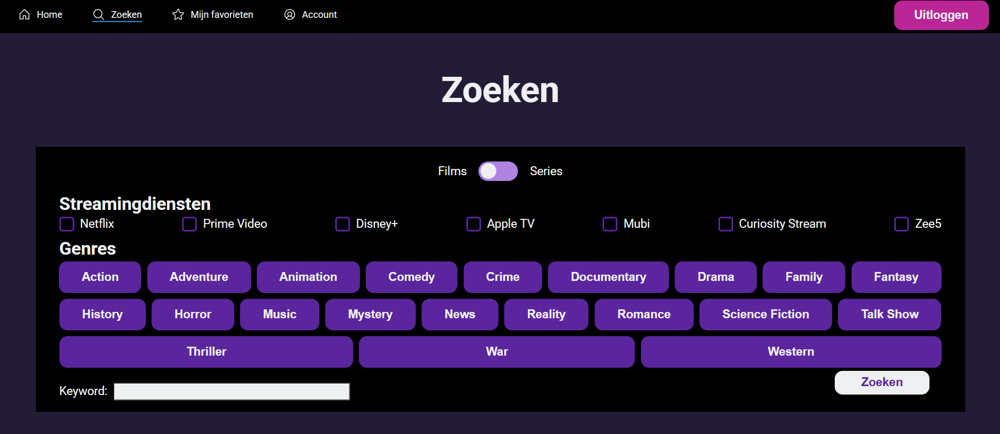
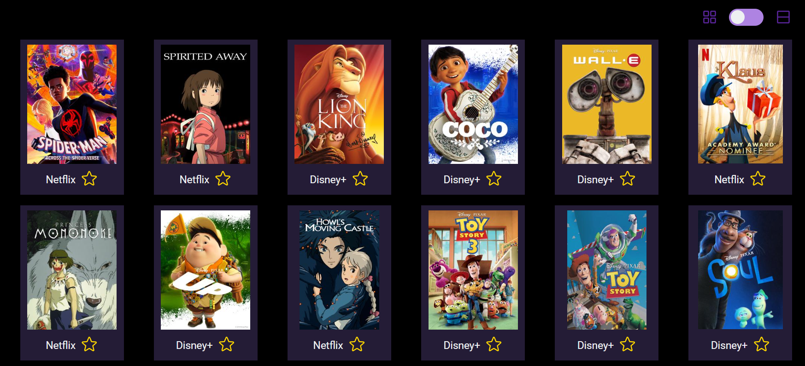

# MovieSearcher

## 1. Inleiding

De MovieSearcher is een webapplicatie waarmee gebruikers eenvoudig films en series kunnen vinden op verschillende streamingdiensten. Gebruikers kunnen filteren op genre, streamingdienst en zoekwoorden. De applicatie toont gedetailleerde informatie over elke film of serie, inclusief streamingdienst, cast en beschrijving.


_Screenshot van de zoekopties_


_Screenshot van de zoekresultaten met kleine tegels_


_Screenshot van de zoekresultaten met grote tegels_

## 2. Benodigdheden

Om de MovieSearcher te kunnen runnen, heb je de volgende software en gegevens nodig:

* **Node.js en npm:** Zorg ervoor dat Node.js en npm (Node Package Manager) op je systeem zijn geïnstalleerd. Je kunt ze downloaden van [nodejs.org](https://nodejs.org/).
* **API-sleutels:** Voor deze applicatie zijn API-sleutels vereist om gegevens van de filmdatabase op te halen.
    * Maak een `.env`-bestand in de root van het project.
    * Vul dit bestand met de volgende variabelen:

        ```
        VITE_API_KEY=moviesearcher:QgUz498OFaHSAWqGjIvS
        VITE_RAPIDAPI_KEY=5b9c13ca93msh7d7c427331406c1p13d79fjsne76971a64dcc
        ```

* **Browser:** Een moderne webbrowser zoals Chrome, Firefox of Edge.

## 3. Installatie-instructies

Volg deze stappen om de MovieSearcher te installeren en te starten:

1.  **Clone de repository:** Open je terminal en voer het volgende commando uit om de repository te clonen:

    `git clone https://github.com/MarjolijnMuller/movieSearcher`

2.  **Navigeer naar de projectmap:** Ga naar de gekloonde map:

    `cd MovieSearcher`

3.  **Installeer de afhankelijkheden:** Voer het volgende commando uit om de benodigde npm-pakketten te installeren:

    `npm install`

4.  **Voeg de API-sleutels toe:**
    * Zorg ervoor dat je een `.env`-bestand hebt aangemaakt zoals beschreven in de sectie "Benodigdheden".

5.  **Start de applicatie:** Voer het volgende commando uit om de applicatie te starten:

    `npm run dev`

6.  **Open de applicatie in je browser:** De applicatie wordt geopend in je standaardbrowser op `http://localhost:5174`.

## 4. Beschikbare npm-commando's

* `npm run dev`: Start de ontwikkelserver.
* `npm run build`: Bouwt de applicatie voor productie (indien geconfigureerd).